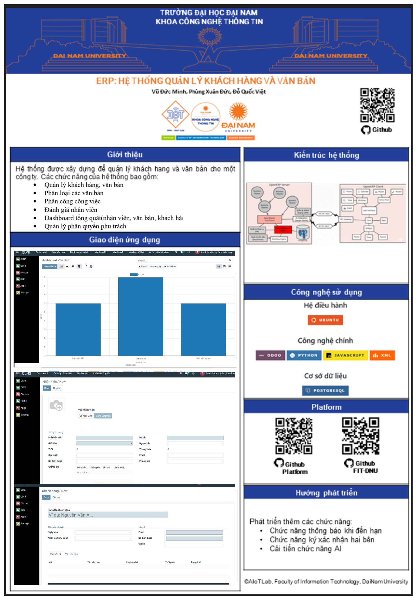
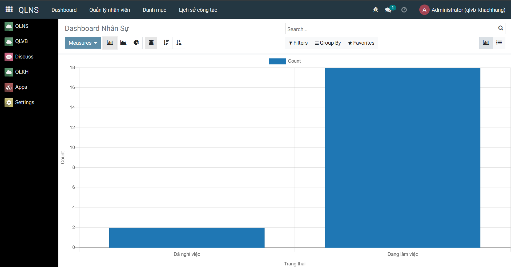
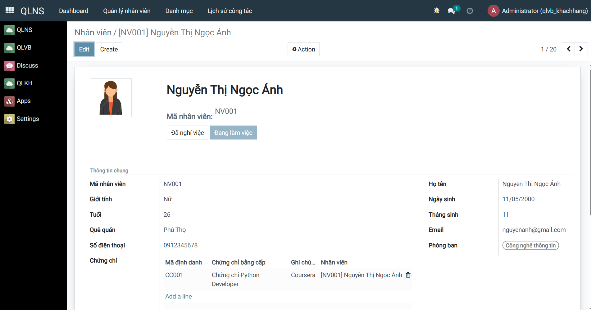
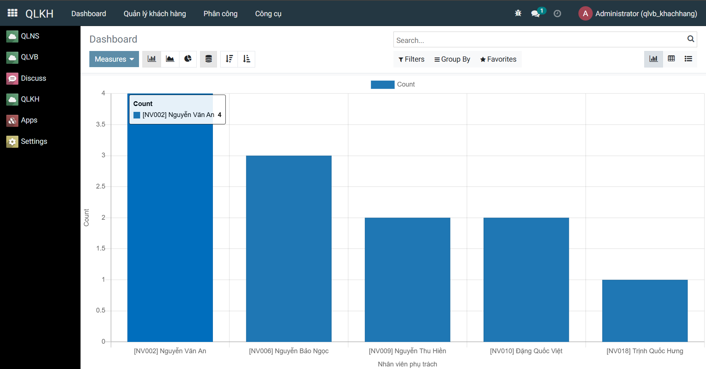
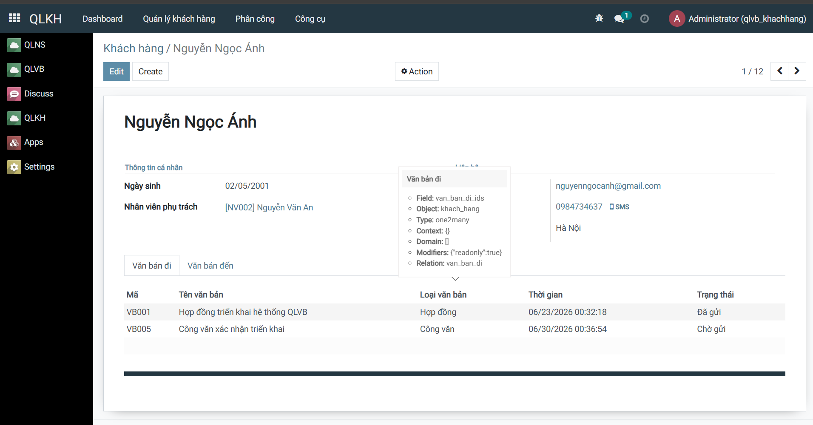
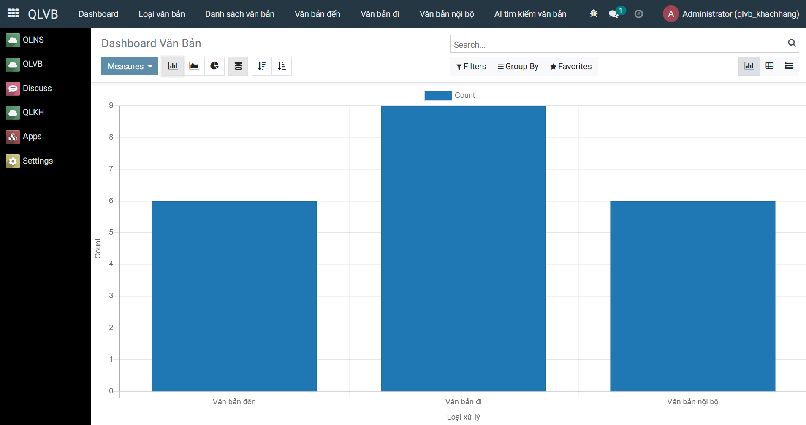
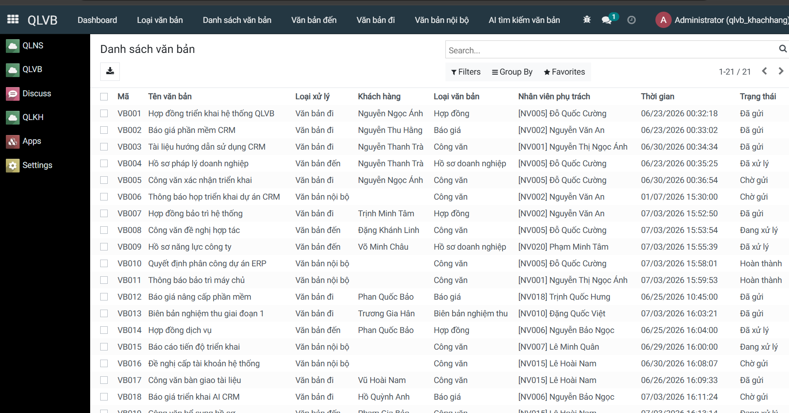
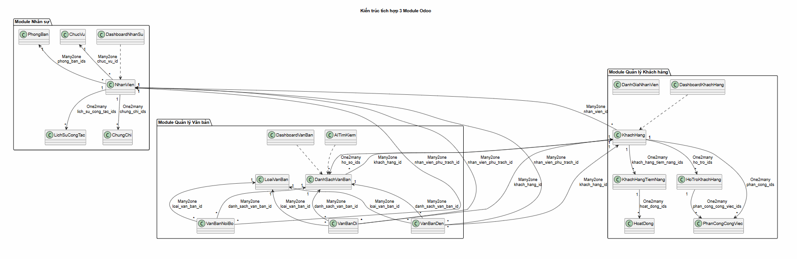
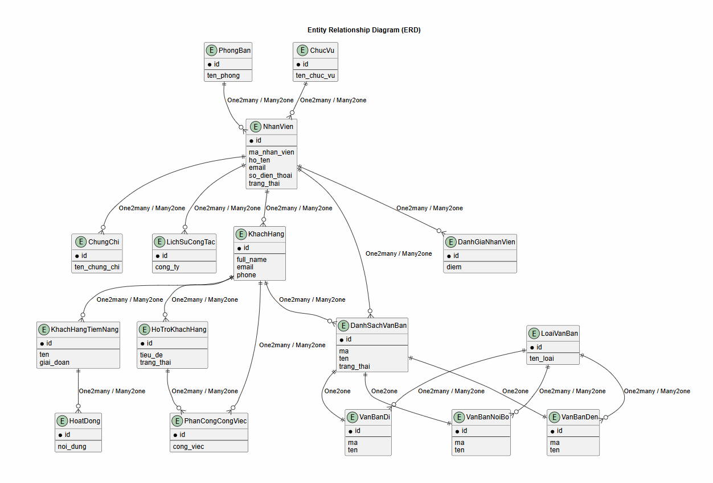

<h2 align="center">
    <a href="https://dainam.edu.vn/vi/khoa-cong-nghe-thong-tin">
    🎓 Khoa Công nghệ Thông tin (Đại học Đại Nam)
    </a>
</h2>
<h2 align="center">
    HỆ THỐNG QUẢN LÝ VĂN BẢN – KHÁCH HÀNG
</h2>
<div align="center">
    <p align="center">
        
        
        
    </p>

[](https://www.facebook.com/DNUAIoTLab)
[](https://dainam.edu.vn/vi/khoa-cong-nghe-thong-tin)
[](https://dainam.edu.vn)

</div>

## 📖 Poster
<p align="center">
  
</p> 

## 🔧Các công nghệ được sử dụng
<div align="center">

### Hệ điều hành
[](https://ubuntu.com/)
### Công nghệ chính
[](https://www.odoo.com/)
[](https://www.python.org/)
[](https://developer.mozilla.org/en-US/docs/Web/JavaScript)
[](https://www.w3.org/XML/)
### Cơ sở dữ liệu
[](https://www.postgresql.org/)
</div>

## 1. Giới thiệu
| Module | Mô Tả | Phụ Thuộc | Ghi chú/Tác giả |
| :--- | :--- | :--- | :--- |
| `quan_ly_khach_hang` | Quản lý thông tin khách hàng và đơn hàng | `base`, `nhan_su` |
| `nhan_su` | Điều phối nhân viên phụ trách từng đầu mục công việc và theo dõi tiến độ xử lý văn bản | `base`|
| `van_ban` | Quản lý văn bản đến/đi/nội bộ | `base`, `quan_ly_khach_hang` | 🔗 [MinnKaa/TTDN-16-02-N7](https://github.com/MinnKaa/TTDN-16-02-N7.git) |

Hệ thống được xây dựng trên nền tảng **Odoo ERP**, tích hợp ba module chính:

*   **Quản lý văn bản:** 
    *   Quản lý văn bản đến, văn bản đi và văn bản nội bộ.
    *   Theo dõi trạng thái xử lý, lưu trữ hồ sơ số.
    *   Phân loại văn bản và thống kê trên Dashboard.
*   **Quản lý nhân sự:** 
    *   Quản lý thông tin nhân viên, phòng ban.
    *   Lưu trữ lịch sử công tác và theo dõi tình trạng làm việc.
*   **Quản lý khách hàng:** 
    *   Quản lý thông tin khách hàng và khách hàng tiềm năng.
    *   Phân công nhân viên phụ trách.
    *   Liên kết hồ sơ văn bản của từng khách hàng.
 
### 1.1. Tóm Tắt Chức Năng Module
### a. Module Quản lý nhân sự
*   **Chức năng chính**: Quản lý thông tin nhân viên, phòng ban và lịch sử công tác.
*   **Dashboard**: Bổ sung Dashboard thống kê nhân sự theo thời gian thực.
*   **Định danh**: Đề xuất bổ sung Mã nhân viên (ví dụ: NV001,...) để hỗ trợ định danh, tìm kiếm và liên kết dữ liệu với các module khác.

### b. Module Quản lý khách hàng
*   **Chức năng chính**: Quản lý khách hàng, khách hàng tiềm năng và nhân viên phụ trách.
*   **Số hóa hồ sơ**: Liên kết toàn bộ văn bản đến, văn bản đi theo từng khách hàng, hỗ trợ xem trực tiếp file PDF và tra cứu lịch sử giao dịch.
*   **Tự động hóa**: Tự động đồng bộ hồ sơ văn bản của khách hàng từ module Quản lý văn bản.

### c. Module Quản lý văn bản
*   **Chức năng chính**: Quản lý Văn bản đến, Văn bản đi và Văn bản nội bộ.
*   **Quản lý tập trung**: Xây dựng Danh sách văn bản làm nơi quản lý tập trung, liên kết với các loại văn bản nhằm giảm trùng lặp dữ liệu và thuận tiện tra cứu.
*   **Định danh tự động**: Tự động sinh mã văn bản chung (ví dụ: VB001, VB002,...) theo một sequence duy nhất và tự động đồng bộ khi thêm, sửa, xóa văn bản.
*   **Dashboard**: Bổ sung Dashboard thống kê số lượng văn bản theo trạng thái, loại văn bản và loại xử lý.

## 2. Module 1: nhan_su
### 2.1. Thông Tin Module
| Thuộc tính | Gía Trị |
| :--- | :--- |
| `Tên kỹ thuật` |  nhan_su|
| `Tên hiển thị` |  QLNS|

Cấu trúc thư mục sau cải tiến:

```text
nhan_su/
│
├── models/
│   ├── __init__.py              # Cập nhật import các model mới.
│   │
│   ├── nhan_vien.py
│   │   → CẢI TIẾN CHÍNH
│   │   - Bổ sung các trường:
│   │       + Giới tính
│   │       + Trạng thái làm việc
│   │       + Ảnh nhân viên (image_1920)
│   │   - Tự động tính Tuổi và Tháng sinh.
│   │
│   ├── phong_ban.py
│   │   → Cải tiến liên kết với Nhân viên (Many2many).
│   │
│   ├── chuc_vu.py
│   │
│   ├── lich_su_cong_tac.py
│   │
│   ├── chung_chi.py
│   │
│   └── dashboard_nhan_su.py
│       → CẢI TIẾN
│       - Xây dựng Dashboard thống kê:
│           + Tổng số nhân viên
│           + Đang làm việc
│           + Đã nghỉ việc
│       - Tự động cập nhật bằng search_count().
│
├── security/
│   └── ir.model.access.csv
│       → Cập nhật quyền truy cập cho model mới.
│
├── views/
│   ├── nhan_vien.xml
│   │
│   ├── phong_ban.xml
│   │
│   ├── chuc_vu.xml
│   │
│   ├── chung_chi.xml
│   │
│   ├── lich_su_cong_tac.xml
│   │
│   ├── dashboard_nhan_su.xml
│   │
│   └── menu.xml
│       → Cập nhật menu Dashboard và các chức năng mới.
│
├── __init__.py
│   → Cập nhật khai báo module.
│
└── __manifest__.py        # Cập nhật dependency, data và views sau cải tiến.
```

### 2.2. Các Cải Tiến Chính mà nhóm đã thực hiện

Nhóm đã thực hiện các cải tiến sau đây cho module nhan_su:

| Cải tiến | Mô tả |
| :--- | :--- |
| **Bổ sung mã và thông tin nhân viên** | Thêm mã nhân viên cùng các thông tin như giới tính, trạng thái làm việc và ảnh nhân viên. |
| **Dashboard nhân sự** | Thống kê tổng số nhân viên, nhân viên đang làm việc và đã nghỉ việc, cập nhật tự động theo dữ liệu thực tế. |
| **Tự động tính toán** | Tự động tính tuổi và tháng sinh từ ngày sinh của nhân viên. |

### 2.3. Giao Diện Người Dùng

### Dashboard quản lý nhân viên

<p align="center">
  
</p>

### Giao diện nhân viên khi cải tiến hơn

<p align="center">
  
</p>

## 3. Module 2: quan_ly_khach_hang

### 3.1. Thông Tin Module

| Thuộc tính | Gía Trị |
| :--- | :--- |
| `Tên kỹ thuật` |  quan_ly_khach_hang |
| `Tên hiển thị` |  QLKH |

Cấu trúc thư mục sau cải tiến:

```text
quan_ly_khach_hang/
├── models/
│   ├── __init__.py               
│   │
│   ├── khach_hang.py
│   │   → CẢI TIẾN: Bổ sung chức năng số hóa hồ sơ khách hàng Liên kết hồ sơ văn bản điện tử với    
        từng khách hàng.
│   │
│   ├── khach_hang_tiem_nang.py
│   │
│   ├── ho_tro_khach_hang.py
│   │
│   ├── hoat_dong.py
│   │
│   ├── phan_cong_cong_viec.py
│   │
│   ├── danh_gia_nhan_vien.py
│   │
│   ├── hop_dong.py
│   │
│   └── dashboard_khach_hang.py
│       → CẢI TIẾN
│       - Dashboard thống kê khách hàng, nhân viên phụ trách số khách hàng
│
├── security/
│   └── ir.model.access.csv                         # Cập nhật quyền truy cập cho các model mới.
│
├── views/
│   ├── khach_hang.xml
│   │   → CẢI TIẾN GIAO DIỆN
│   │   - Bổ sung tab Hồ sơ số.
│   │   - Hiển thị danh sách văn bản điện tử của từng khách hàng.
│   │
│   ├── dashboard_khach_hang.xml       # Thiết kế Dashboard thống kê trực quan.
│   │
│   ├── khach_hang_tiem_nang.xml
│   │
│   ├── ho_tro_khach_hang.xml
│   │
│   ├── hoat_dong.xml
│   │
│   ├── phan_cong_cong_viec.xml
│   │
│   ├── danh_gia_nhan_vien.xml
│   │
│   └── menu.xml
│
├── __init__.py
│
└── __manifest__.py
```

### 3.2. Các Cải Tiến Chính mà nhóm đã thực hiện

Nhóm đã thực hiện các cải tiến sau đây cho module quan_ly_khach_hang:

| Cải tiến | Mô tả |
| :--- | :--- |
| **Số hóa hồ sơ khách hàng** | Liên kết và lưu trữ tập trung văn bản điện tử theo từng khách hàng, hỗ trợ tra cứu và xem trực tiếp hồ sơ. |
| **Dashboard khách hàng** | Thống kê khách hàng, khách hàng tiềm năng, hợp đồng và hỗ trợ khách hàng, cập nhật tự động theo dữ liệu thực tế. |

### 3.3. Giao Diện Người Dùng

### Dashboard quản lý khách hàng

<p align="center">
  
</p>

### Số hóa hồ sơ khách hàng

<p align="center">
  
</p>

## 4. Module 3: quan_ly_van_ban

### 4.1. Thông Tin Module
| Thuộc tính | Gía Trị |
| :--- | :--- |
| `Tên kỹ thuật` |  quan_ly_van_ban|
| `Tên hiển thị` |  QLVB |

Cấu trúc thư mục sau cải tiến:

```text
quan_ly_van_ban/
├── data/
│   ├── dashboard_data.xml              # Khởi tạo dữ liệu cho Dashboard.
│   │
│   └── sequence.xml      # CẢI TIẾN: Bổ sung Sequence dùng chung để tự động sinh mã cho văn bản (VB001, VB002...).
│
├── models/
│   ├── __init__.py
│   │
│   ├── danh_sach_van_ban.py
│   │   → CẢI TIẾN
│   │   - Xây dựng danh sách văn bản quản lý tập trung.
│   │   - Đồng bộ dữ liệu từ Văn bản đến, Văn bản đi và Văn bản nội bộ.
│   │
│   ├── van_ban_den.py         # Cải tiến tự động sinh mã và đồng bộ dữ liệu sang Danh sách văn bản.
│   │
│   ├── van_ban_di.py         #Cải tiến tự động sinh mã và đồng bộ dữ liệu sang Danh sách văn bản.
│   │
│   ├── van_ban_noi_bo.py       #Cải tiến tự động sinh mã và đồng bộ dữ liệu sang Danh sách văn bản.
│   │
│   ├── dashboard_van_ban.py            # CẢI TIẾN: Dashboard thống kê văn bản theo thời gian thực.
│   │
│   ├── khach_hang_inherit.py            # Bổ sung liên kết hồ sơ văn bản với khách hàng.
│   │
│   ├── loai_van_ban.py
│   │
│   └── ai_tim_kiem.py
│
├── security/
│   └── ir.model.access.csv
│
├── views/
│   ├── danh_sach_van_ban_views.xml
│   │
│   ├── dashboard_van_ban.xml           # Thiết kế Dashboard thống kê trực quan.
│   │
│   ├── khach_hang_inherit_views.xml          # Hiển thị hồ sơ số của khách hàng.
│   │
│   ├── van_ban_den_views.xml
│   │
│   ├── van_ban_di_views.xml
│   │
│   ├── van_ban_noi_bo_views.xml
│   │
│   ├── loai_van_ban_views.xml
│   │
│   ├── ai_tim_kiem_views.xml
│   │
│   └── menu.xml
│
├── __init__.py
│
└── __manifest__.py
```

### 4.2. Các Cải Tiến Chính mà nhóm đã thực hiện

Bảng mô tả các cải tiến Module Quản lý văn bản

| Cải tiến | Mô tả |
| :--- | :--- |
| **Danh sách văn bản tập trung** | Liên kết Văn bản đến, Văn bản đi và Văn bản nội bộ vào một danh sách quản lý thống nhất, giảm trùng lặp dữ liệu. |
| **Tự động sinh mã văn bản** | Sử dụng một Sequence chung để sinh mã văn bản liên tục (VB001, VB002...). |
| **Đồng bộ dữ liệu** | Tự động cập nhật Danh sách văn bản khi thêm, sửa hoặc xóa các loại văn bản. |
| **Dashboard văn bản** | Thống kê số lượng văn bản theo loại và trạng thái, cập nhật theo dữ liệu thực tế. |
| **Số hóa hồ sơ khách hàng** | Liên kết văn bản với khách hàng, hỗ trợ quản lý và tra cứu hồ sơ điện tử theo từng khách hàng. |

### 4.3. Giao Diện Người Dùng

### Dashboard quản lý văn bản

<p align="center">
  
</p>

### Giao diện Danh sách văn bản tập trung

<p align="center">
  
</p>

## 5. Kiến Trúc Tích Hợp

<p align="center">
  
</p>

## 6. Entity Relationship Diagram

<p align="center">
  
</p>

## ⚙️ 7. Cài đặt

### 7.1. Cài đặt công cụ, môi trường và các thư viện cần thiết

#### 7.1.1. Tải project.
```
git clone https://github.com/FIT-DNU/Business-Internship.git
```
#### 7.1.2. Cài đặt các thư viện cần thiết
Người sử dụng thực thi các lệnh sau đề cài đặt các thư viện cần thiết

```
sudo apt-get install libxml2-dev libxslt-dev libldap2-dev libsasl2-dev libssl-dev python3.10-distutils python3.10-dev build-essential libssl-dev libffi-dev zlib1g-dev python3.10-venv libpq-dev
```
#### 7.1.3. Khởi tạo môi trường ảo.
- Khởi tạo môi trường ảo
```
python3.10 -m venv ./venv
```
- Thay đổi trình thông dịch sang môi trường ảo
```
source venv/bin/activate
```
- Chạy requirements.txt để cài đặt tiếp các thư viện được yêu cầu
```
pip3 install -r requirements.txt
```
### 7.2. Setup database

Khởi tạo database trên docker bằng việc thực thi file dockercompose.yml.
```
sudo docker-compose up -d
```
### 7.3. Setup tham số chạy cho hệ thống
Tạo tệp **odoo.conf** có nội dung như sau:
```
[options]
addons_path = addons
db_host = localhost
db_password = odoo
db_user = odoo
db_port = 5431
xmlrpc_port = 8069
```
Có thể kế thừa từ file **odoo.conf.template**
### 7.4. Chạy hệ thống và cài đặt các ứng dụng cần thiết
Lệnh chạy
```
python3 odoo-bin.py -c odoo.conf -u all
```
Người sử dụng truy cập theo đường dẫn _http://localhost:8069/_ để đăng nhập vào hệ thống.

## 8. Nguồn tham khảo

https://github.com/MinnKaa/TTDN-16-02-N7

## 📝9. License

© 2024 AIoTLab, Faculty of Information Technology, DaiNam University. All rights reserved.

---

    
